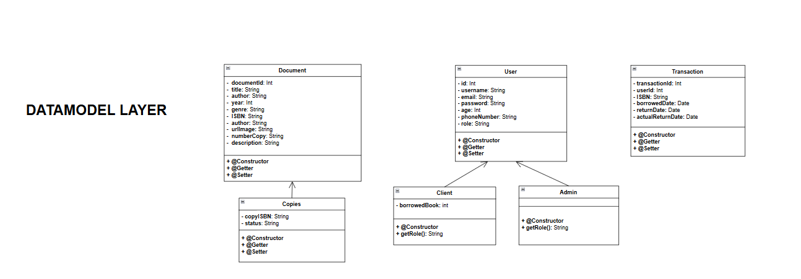
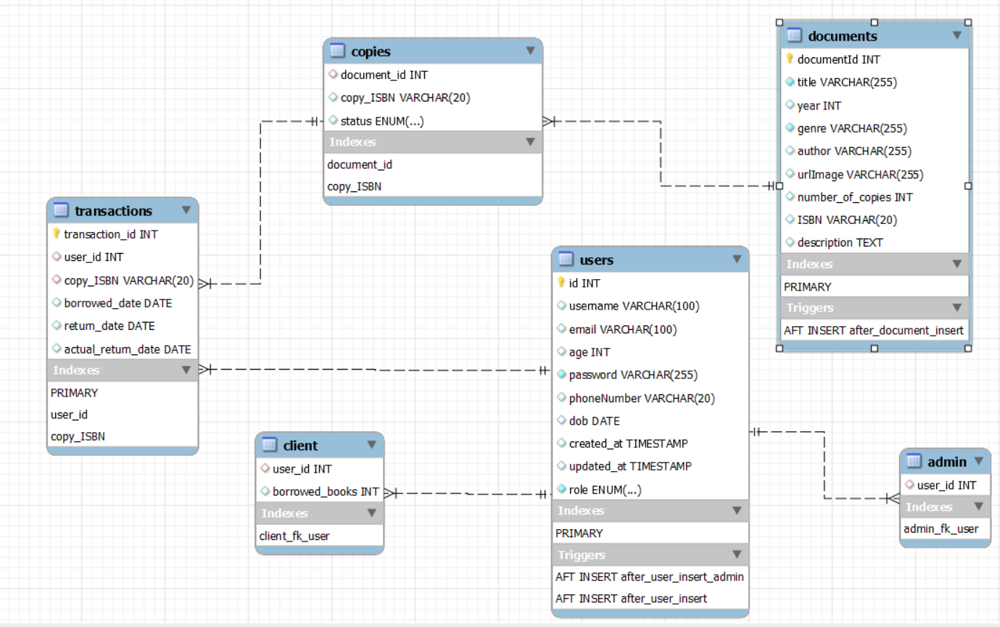
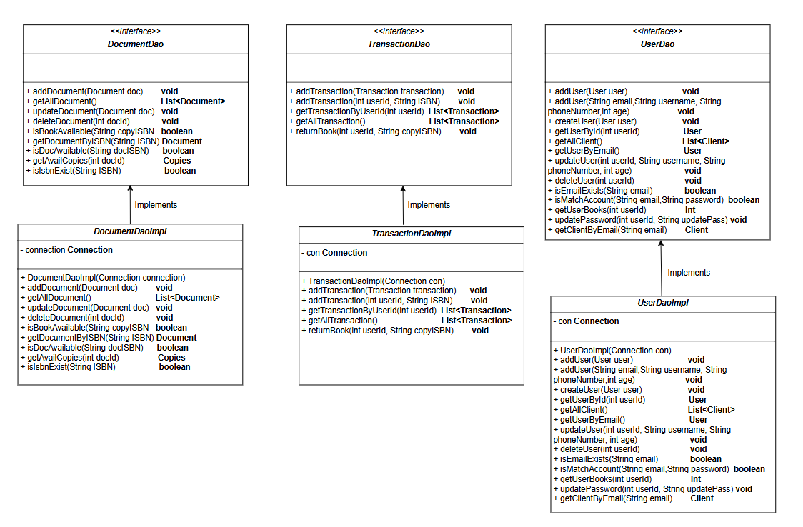
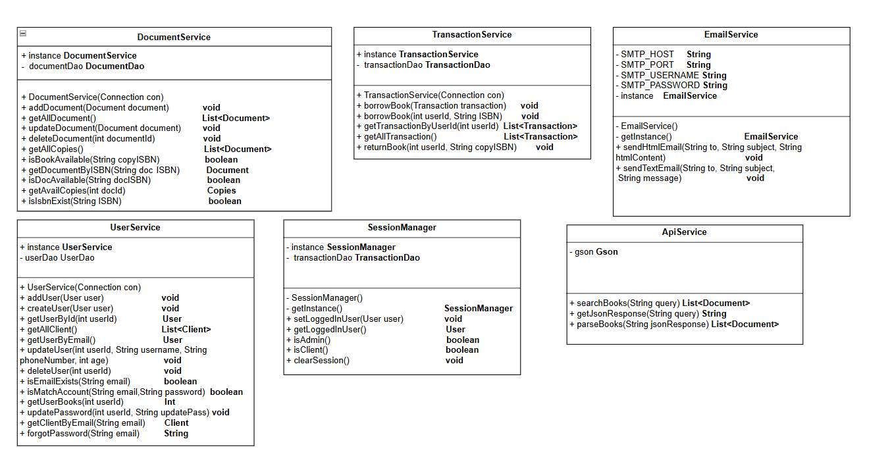

# 📚 Ứng dụng Quản Lý Thư Viện

## 📋 Mục lục
1. [Tổng quan](#tổng-quan)
2. [Tính năng](#tính-năng)
3. [Cấu trúc ứng dụng](#cấu-trúc-ứng-dụng)
    - [Models](#models)
    - [Use Cases](#use-cases)
    - [Services](#services)
    - [Controllers](#controllers)
4. [Cài đặt và thiết lập](#cài-đặt-và-thiết-lập)
5. [Hướng dẫn sử dụng](#hướng-dẫn-sử-dụng)
6. [Các cải tiến trong tương lai](#các-cải-tiến-trong-tương-lai)
7. [Tác giả](#tác-giả)

---

## 📝 Tổng quan
Ứng dụng **Quản lý thư viện** được phát triển bằng JavaFX nhằm hỗ trợ quản lý thông tin sách, độc giả và hoạt động mượn/trả sách. Mục tiêu chính là tối ưu hóa quy trình quản lý thư viện cho các quản trị viên và cung cấp giao diện thân thiện với người dùng.

---

## ✨ Tính năng
Các tính năng nổi bật của ứng dụng bao gồm:

### 🛠️ Dành cho Admin
- **Quản lý sách**: Thêm, sửa, xóa thông tin sách.
- **Quản lý người sử dụng**: Thêm, sửa, xóa thông tin người dùng.
- **Quản lý mượn/trả sách**: Xử lý các yêu cầu mượn sách và trả sách từ người dùng.
- **Tìm kiếm nâng cao**:
    - Tìm kiếm và thêm sách theo API.
    - Tìm kiếm sách theo tiêu chí (tên sách, tác giả, thể loại,...).

### 📚 Dành cho Client (Người dùng)
- **Tìm kiếm sách**:
    - Tìm kiếm sách theo tên, tác giả, hoặc thể loại.
    - Xem trạng thái của sách (đang mượn, có sẵn...).
- **Xem lịch sử mượn sách**:
    - Hiển thị danh sách các sách đã mượn và trả.
    - Kiểm tra thời hạn trả sách.
- **Đăng ký && Đăng nhập tài khoản**:
    - Đăng ký và đăng nhập tài khoản với email và password.

---

## 🏗️ Cấu trúc ứng dụng

### 📦 Class Model

- `Kiến trúc của APP được thiết kế theo 3 lớp`:
  - `Data Access Layer (DAL)`: DAO - quản lý truy cập dữ liệu.
  - `Service`: Chứa logic nghiệp vụ và gọi DAO.
  - `Controller` : Tiếp nhận sự kiện từ người dùng và gọi service để xử lý.

**Các model chính trong ứng dụng được thể hiện qua UML sau:**
    
###  Class Model




###  Database Model




### DAO Model



### Service




### 🧩 Use Cases
Các trường hợp sử dụng chính:

1. **Quản trị viên**:
    - Thêm, sửa, xóa thông tin sách.
    - Quản lý danh sách độc giả.
    - Xem lịch sử mượn/trả.
2. **Độc giả**:
    - Tra cứu thông tin sách.
    - Kiểm tra lịch sử mượn sách của mình.

### 🛠️ Services
Các service xử lý logic nghiệp vụ:
- **BookService**: Quản lý dữ liệu liên quan đến sách.
- **ReaderService**: Xử lý thông tin độc giả.
- **BorrowService**: Xử lý các giao dịch mượn và trả sách.

### 🎛️ Controllers
Các controller điều khiển giao diện và liên kết logic:
- **MainController**: Quản lý giao diện chính và điều hướng.
- **BookController**: Quản lý giao diện và hành động liên quan đến sách.
- **ReaderController**: Quản lý giao diện và hành động liên quan đến độc giả.
- **BorrowController**: Xử lý giao diện mượn/trả sách.

---

## ⚙️ Cài đặt và thiết lập
1. **Yêu cầu hệ thống**:
    - JDK 17 hoặc mới hơn.
    - JavaFX SDK.
    - IDE hỗ trợ Java (IntelliJ IDEA, Eclipse...).

2. **Cài đặt**:
    - Clone repository:
      ```bash
      git clone https://github.com/your-repo/library-management.git
      cd library-management
      ```
    - Cấu hình JavaFX SDK trong IDE.
    - Chạy ứng dụng.

---

## 🚀 Hướng dẫn sử dụng
1. Mở ứng dụng.
2. Đăng nhập với tài khoản quản trị viên.
3. Điều hướng qua các tab để quản lý sách, độc giả, và giao dịch mượn/trả.

---

## 🔮 Các cải tiến trong tương lai
- Tích hợp API để đồng bộ dữ liệu.
- Thêm chức năng quản lý danh mục sách nâng cao.
- Phát triển ứng dụng web song song.

---

## ✍️ Tác giả
- **Họ tên**: [Tên của bạn]
- **Liên hệ**: [Email hoặc mạng xã hội]
- **GitHub**: [Link GitHub của bạn]

---
